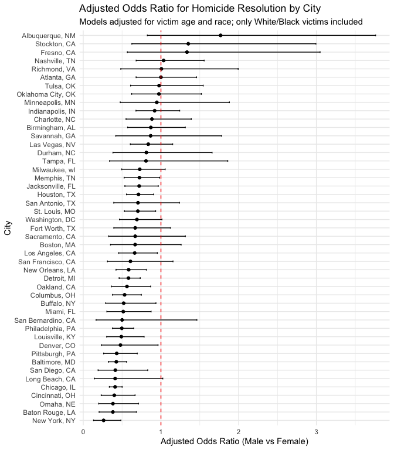
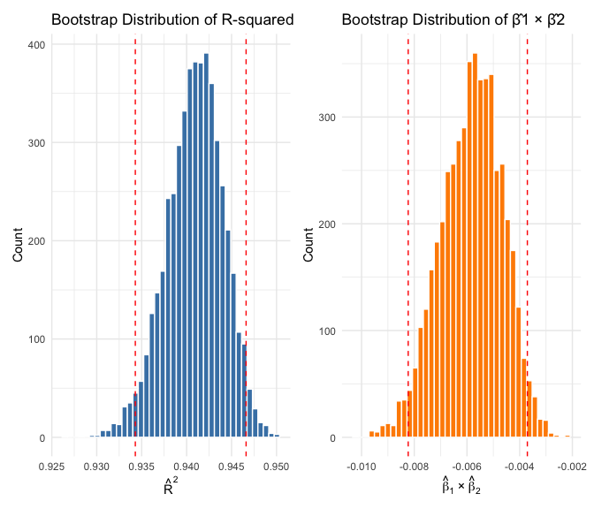
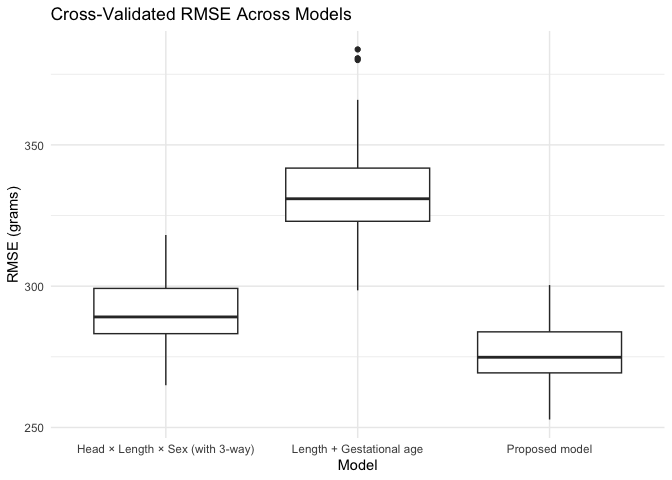

Homework 6: Homicides, Bootstrap Regression, and Birthweight Modeling
================
Spencer Riddell

- [Problem 1: Homicides in U.S.
  Cities](#problem-1-homicides-in-us-cities)
  - [Comments on the plot](#comments-on-the-plot)
- [Problem 2: Bootstrap for Linear Regression
  Metrics](#problem-2-bootstrap-for-linear-regression-metrics)
  - [Description of distributions and 95%
    intervals](#description-of-distributions-and-95-intervals)
- [Problem 3: Birthweight Modeling](#problem-3-birthweight-modeling)
  - [Modeling](#modeling)

# Problem 1: Homicides in U.S. Cities

``` r
homicides_url <- "https://raw.githubusercontent.com/washingtonpost/data-homicides/master/homicide-data.csv"

homicides_raw <- read_csv(homicides_url, show_col_types = FALSE) |> 
  clean_names()

glimpse(homicides_raw)
```

    ## Rows: 52,179
    ## Columns: 12
    ## $ uid           <chr> "Alb-000001", "Alb-000002", "Alb-000003", "Alb-000004", …
    ## $ reported_date <dbl> 20100504, 20100216, 20100601, 20100101, 20100102, 201001…
    ## $ victim_last   <chr> "GARCIA", "MONTOYA", "SATTERFIELD", "MENDIOLA", "MULA", …
    ## $ victim_first  <chr> "JUAN", "CAMERON", "VIVIANA", "CARLOS", "VIVIAN", "GERAL…
    ## $ victim_race   <chr> "Hispanic", "Hispanic", "White", "Hispanic", "White", "W…
    ## $ victim_age    <chr> "78", "17", "15", "32", "72", "91", "52", "52", "56", "4…
    ## $ victim_sex    <chr> "Male", "Male", "Female", "Male", "Female", "Female", "M…
    ## $ city          <chr> "Albuquerque", "Albuquerque", "Albuquerque", "Albuquerqu…
    ## $ state         <chr> "NM", "NM", "NM", "NM", "NM", "NM", "NM", "NM", "NM", "N…
    ## $ lat           <dbl> 35.09579, 35.05681, 35.08609, 35.07849, 35.13036, 35.151…
    ## $ lon           <dbl> -106.5386, -106.7153, -106.6956, -106.5561, -106.5810, -…
    ## $ disposition   <chr> "Closed without arrest", "Closed by arrest", "Closed wit…

``` r
# Create city_state; solved binary; filter cities and races; ensure victim_age numeric
homicides <- homicides_raw |>
  mutate(
    city_state = glue("{city}, {state}"),
    # solved: disposition values include "Closed by arrest" vs others
    solved = case_when(
      disposition == "Closed by arrest" ~ 1L,
      TRUE ~ 0L
    ),
    solved = factor(solved, levels = c(0,1), labels = c("Unresolved","Resolved")),
    # normalize race and sex labels
    victim_race = str_to_lower(victim_race),
    victim_sex = case_when(
      victim_sex %in% c("Male", "M") ~ "Male",
      victim_sex %in% c("Female", "F") ~ "Female",
      TRUE ~ NA_character_
    ),
    victim_sex = factor(victim_sex),
    victim_race = factor(victim_race),
    # coerce victim_age numeric (some entries may be "Unknown")
    victim_age = suppressWarnings(as.numeric(victim_age))
  ) |>
  # exclude specified cities
  filter(!(city_state %in% c("Dallas, TX", "Phoenix, AZ", "Kansas City, MO", "Tulsa, AL"))) |>
  # limit to white/black
  filter(victim_race %in% c("white", "black"))

# Check missingness summary
homicides_missing_summary <- homicides |>
  summarize(
    n = n(),
    missing_age = sum(is.na(victim_age)),
    missing_sex = sum(is.na(victim_sex)),
    missing_race = sum(is.na(victim_race)),
    missing_solved = sum(is.na(solved))
  )

homicides_missing_summary
```

    ## # A tibble: 1 × 5
    ##       n missing_age missing_sex missing_race missing_solved
    ##   <int>       <int>       <int>        <int>          <int>
    ## 1 39693         290          41            0              0

``` r
# Baltimore model: logistic regression with victim_age, victim_sex, victim_race
baltimore_df <- homicides |> filter(city_state == "Baltimore, MD")

baltimore_glm <- glm(
  solved ~ victim_age + victim_sex + victim_race,
  data = baltimore_df,
  family = binomial()
)

baltimore_tidy <- broom::tidy(baltimore_glm, conf.int = TRUE, conf.level = 0.95, exponentiate = FALSE)

# Extract coefficient for victim_sexMale, convert to OR and CI by exponentiating
baltimore_or <- baltimore_tidy |>
  filter(term == "victim_sexMale") |>
  transmute(
    city_state = "Baltimore, MD",
    term,
    estimate_logit = estimate,
    conf_low_logit = conf.low,
    conf_high_logit = conf.high,
    OR = exp(estimate),
    OR_low = exp(conf.low),
    OR_high = exp(conf.high)
  )

baltimore_or
```

    ## # A tibble: 1 × 8
    ##   city_state    term  estimate_logit conf_low_logit conf_high_logit    OR OR_low
    ##   <chr>         <chr>          <dbl>          <dbl>           <dbl> <dbl>  <dbl>
    ## 1 Baltimore, MD vict…         -0.854          -1.13          -0.584 0.426  0.324
    ## # ℹ 1 more variable: OR_high <dbl>

``` r
# Fit model for each city; extract OR for male vs female
city_models <- homicides |>
  group_by(city_state) |>
  nest() |>
  mutate(
    # Fit logistic models; some cities may fail if insufficient data -> safely
    model = map(data, ~ safely(function(df) {
      glm(solved ~ victim_age + victim_sex + victim_race, data = df, family = binomial())
    })(.x)$result),
    tidied = map(model, ~ if (!is.null(.x)) tidy(.x, conf.int = TRUE, conf.level = 0.95) else tibble()),
    # Filter term of interest, and compute OR + CI
    or_row = map(tidied, ~ .x |>
                   filter(term == "victim_sexMale") |>
                   transmute(
                     term,
                     estimate_logit = estimate,
                     conf_low_logit = conf.low,
                     conf_high_logit = conf.high,
                     OR = exp(estimate),
                     OR_low = exp(conf.low),
                     OR_high = exp(conf.high)
                   ))
  ) |>
  ungroup() |>
  select(city_state, or_row) |>
  unnest(or_row, keep_empty = TRUE)

# Remove cities with no estimable OR (e.g., missing sex variation) for plotting; keep them noted separately
city_or <- city_models |>
  filter(!is.na(OR))

missing_or_cities <- setdiff(city_models$city_state, city_or$city_state)

list(
  n_cities_total = nrow(city_models),
  n_cities_with_or = nrow(city_or),
  n_cities_missing_or = length(missing_or_cities),
  missing_or_cities = missing_or_cities
)
```

    ## $n_cities_total
    ## [1] 47
    ## 
    ## $n_cities_with_or
    ## [1] 47
    ## 
    ## $n_cities_missing_or
    ## [1] 0
    ## 
    ## $missing_or_cities
    ## character(0)

``` r
# Plot ORs and CIs per city ordered by OR
city_or_plot <- city_or |>
  arrange(OR) |>
  mutate(city_state = factor(city_state, levels = city_state)) |>
  ggplot(aes(x = city_state, y = OR)) +
  geom_point() +
  geom_errorbar(aes(ymin = OR_low, ymax = OR_high), width = 0.2) +
  geom_hline(yintercept = 1, linetype = "dashed", color = "red") +
  coord_flip() +
  labs(
    title = "Adjusted Odds Ratio for Homicide Resolution by City",
    subtitle = "Models adjusted for victim age and race; only White/Black victims included",
    x = "City",
    y = "Adjusted Odds Ratio (Male vs Female)"
  ) +
  theme_minimal()

city_or_plot
```

<!-- -->

### Comments on the plot

- The dashed line at OR = 1 indicates no difference in resolution odds
  between male and female victims after adjusting for age and race.
- Cities to the right of the line (OR \> 1) suggest higher odds of
  resolution for male victims relative to female victims; those to the
  left (OR \< 1) suggest lower odds.
- The width of the error bars reflects uncertainty; wide intervals may
  indicate limited data or variability.
- Across the majority of cities, point estimates cluster close to 1 and
  confidence intervals frequently cross 1, implying that—after adjusting
  for victim age and race—sex is not a strong, consistent predictor of
  case resolution. This pattern suggests operational or investigative
  factors driving resolution are largely similar across male and female
  victims in most jurisdictions.
- Significant cities all fall below OR = 1, indicating lower odds of
  resolution for male victims compared to female victims.

# Problem 2: Bootstrap for Linear Regression Metrics

``` r
library(p8105.datasets)
data("weather_df")

glimpse(weather_df)
```

    ## Rows: 2,190
    ## Columns: 6
    ## $ name <chr> "CentralPark_NY", "CentralPark_NY", "CentralPark_NY", "CentralPar…
    ## $ id   <chr> "USW00094728", "USW00094728", "USW00094728", "USW00094728", "USW0…
    ## $ date <date> 2021-01-01, 2021-01-02, 2021-01-03, 2021-01-04, 2021-01-05, 2021…
    ## $ prcp <dbl> 157, 13, 56, 5, 0, 0, 0, 0, 0, 0, 0, 0, 0, 0, 97, 198, 0, 0, 0, 5…
    ## $ tmax <dbl> 4.4, 10.6, 3.3, 6.1, 5.6, 5.0, 5.0, 2.8, 2.8, 5.0, 2.8, 6.7, 6.1,…
    ## $ tmin <dbl> 0.6, 2.2, 1.1, 1.7, 2.2, 1.1, -1.0, -2.7, -4.3, -1.6, -2.1, 0.6, …

``` r
set.seed(123)

# Helper: fit model and extract R^2 and product of coefficients
fit_extract <- function(df) {
  mdl <- lm(tmax ~ tmin + prcp, data = df)
  r2 <- glance(mdl)$r.squared
  coefs <- tidy(mdl)
  # Identify terms for tmin and prcp, compute product
  b1 <- coefs |> filter(term == "tmin") |> pull(estimate)
  b2 <- coefs |> filter(term == "prcp") |> pull(estimate)
  tibble(r2 = r2, beta_prod = b1 * b2)
}

# Bootstrap resampling indices by day or full observation? We'll resample rows
n_boot <- 5000
n <- nrow(weather_df)

boot_results <- map_dfr(1:n_boot, ~ {
  idx <- sample.int(n, size = n, replace = TRUE)
  fit_extract(weather_df[idx, ])
})

boot_summary <- boot_results |>
  summarize(
    r2_mean = mean(r2),
    r2_sd = sd(r2),
    r2_q025 = quantile(r2, 0.025),
    r2_q975 = quantile(r2, 0.975),
    beta_prod_mean = mean(beta_prod),
    beta_prod_sd = sd(beta_prod),
    beta_prod_q025 = quantile(beta_prod, 0.025),
    beta_prod_q975 = quantile(beta_prod, 0.975)
  )

boot_summary
```

    ## # A tibble: 1 × 8
    ##   r2_mean   r2_sd r2_q025 r2_q975 beta_prod_mean beta_prod_sd beta_prod_q025
    ##     <dbl>   <dbl>   <dbl>   <dbl>          <dbl>        <dbl>          <dbl>
    ## 1   0.941 0.00315   0.934   0.947       -0.00582      0.00117       -0.00823
    ## # ℹ 1 more variable: beta_prod_q975 <dbl>

``` r
p_r2 <- boot_results |>
  ggplot(aes(x = r2)) +
  geom_histogram(bins = 40, fill = "steelblue", color = "white") +
  geom_vline(xintercept = boot_summary$r2_q025, linetype = "dashed", color = "red") +
  geom_vline(xintercept = boot_summary$r2_q975, linetype = "dashed", color = "red") +
  labs(
    title = "Bootstrap Distribution of R-squared",
    x = expression(hat(R)^2),
    y = "Count"
  ) +
  theme_minimal()

p_beta_prod <- boot_results |>
  ggplot(aes(x = beta_prod)) +
  geom_histogram(bins = 40, fill = "darkorange", color = "white") +
  geom_vline(xintercept = boot_summary$beta_prod_q025, linetype = "dashed", color = "red") +
  geom_vline(xintercept = boot_summary$beta_prod_q975, linetype = "dashed", color = "red") +
  labs(
    title = "Bootstrap Distribution of β̂1 × β̂2",
    x = expression(hat(beta)[1]~"×"~hat(beta)[2]),
    y = "Count"
  ) +
  theme_minimal()

p_r2 + p_beta_prod
```

<!-- -->

### Description of distributions and 95% intervals

- The bootstrap R-squared is tightly concentrated around ~0.94 with a
  narrow 95% interval (≈0.935–0.946), indicating the model with tmin and
  prcp explains a large and consistently stable fraction of tmax
  variability.
- The distribution of β̂1 × β̂2 centers near a small negative value with a
  symmetric spread (95% interval roughly −0.008 to −0.004), suggesting
  tmin’s positive effect and prcp’s negative effect yield a modestly
  negative product, and this combined magnitude is estimated with
  reasonable precision.

# Problem 3: Birthweight Modeling

``` r
birthweight_url <- "https://p8105.com/data/birthweight.csv"

bw_raw <- read_csv(birthweight_url, show_col_types = FALSE) |> 
  clean_names()

glimpse(bw_raw)
```

    ## Rows: 4,342
    ## Columns: 20
    ## $ babysex  <dbl> 2, 1, 2, 1, 2, 1, 2, 2, 1, 1, 2, 1, 2, 1, 1, 2, 1, 2, 2, 2, 1…
    ## $ bhead    <dbl> 34, 34, 36, 34, 34, 33, 33, 33, 36, 33, 35, 35, 35, 36, 35, 3…
    ## $ blength  <dbl> 51, 48, 50, 52, 52, 52, 46, 49, 52, 50, 51, 51, 48, 53, 51, 4…
    ## $ bwt      <dbl> 3629, 3062, 3345, 3062, 3374, 3374, 2523, 2778, 3515, 3459, 3…
    ## $ delwt    <dbl> 177, 156, 148, 157, 156, 129, 126, 140, 146, 169, 130, 146, 1…
    ## $ fincome  <dbl> 35, 65, 85, 55, 5, 55, 96, 5, 85, 75, 55, 55, 75, 75, 65, 75,…
    ## $ frace    <dbl> 1, 2, 1, 1, 1, 1, 2, 1, 1, 2, 1, 1, 1, 1, 1, 2, 1, 1, 1, 2, 1…
    ## $ gaweeks  <dbl> 39.9, 25.9, 39.9, 40.0, 41.6, 40.7, 40.3, 37.4, 40.3, 40.7, 4…
    ## $ malform  <dbl> 0, 0, 0, 0, 0, 0, 0, 0, 0, 0, 0, 0, 0, 0, 0, 0, 0, 0, 0, 0, 0…
    ## $ menarche <dbl> 13, 14, 12, 14, 13, 12, 14, 12, 11, 12, 13, 12, 13, 11, 12, 1…
    ## $ mheight  <dbl> 63, 65, 64, 64, 66, 66, 72, 62, 61, 64, 67, 62, 64, 68, 62, 6…
    ## $ momage   <dbl> 36, 25, 29, 18, 20, 23, 29, 19, 13, 19, 23, 16, 28, 23, 21, 1…
    ## $ mrace    <dbl> 1, 2, 1, 1, 1, 1, 2, 1, 1, 2, 1, 1, 1, 1, 1, 2, 1, 1, 1, 2, 1…
    ## $ parity   <dbl> 3, 0, 0, 0, 0, 0, 0, 0, 0, 0, 0, 0, 0, 0, 0, 0, 0, 0, 0, 0, 0…
    ## $ pnumlbw  <dbl> 0, 0, 0, 0, 0, 0, 0, 0, 0, 0, 0, 0, 0, 0, 0, 0, 0, 0, 0, 0, 0…
    ## $ pnumsga  <dbl> 0, 0, 0, 0, 0, 0, 0, 0, 0, 0, 0, 0, 0, 0, 0, 0, 0, 0, 0, 0, 0…
    ## $ ppbmi    <dbl> 26.27184, 21.34485, 23.56517, 21.84508, 21.02642, 18.60030, 1…
    ## $ ppwt     <dbl> 148, 128, 137, 127, 130, 115, 105, 119, 105, 145, 110, 115, 1…
    ## $ smoken   <dbl> 0.000, 0.000, 1.000, 10.000, 1.000, 0.000, 0.000, 0.000, 0.00…
    ## $ wtgain   <dbl> 29, 28, 11, 30, 26, 14, 21, 21, 41, 24, 20, 31, 23, 21, 24, 2…

``` r
# Convert appropriate variables to factors; check missingness
bw <- bw_raw |>
  mutate(
    babysex = factor(babysex, levels = c(1,2), labels = c("Male","Female")),
    frace = factor(frace, levels = c(1,2,3,4,8,9),
                   labels = c("White","Black","Asian","PuertoRican","Other","Unknown")),
    mrace = factor(mrace, levels = c(1,2,3,4,8),
                   labels = c("White","Black","Asian","PuertoRican","Other")),
    malform = factor(malform, levels = c(0,1), labels = c("Absent","Present"))
  )

bw_missing_summary <- bw |>
  summarize(across(everything(), ~ sum(is.na(.)))) |>
  pivot_longer(everything(), names_to = "variable", values_to = "n_missing") |>
  arrange(desc(n_missing))

bw_missing_summary |> head(15)
```

    ## # A tibble: 15 × 2
    ##    variable n_missing
    ##    <chr>        <int>
    ##  1 babysex          0
    ##  2 bhead            0
    ##  3 blength          0
    ##  4 bwt              0
    ##  5 delwt            0
    ##  6 fincome          0
    ##  7 frace            0
    ##  8 gaweeks          0
    ##  9 malform          0
    ## 10 menarche         0
    ## 11 mheight          0
    ## 12 momage           0
    ## 13 mrace            0
    ## 14 parity           0
    ## 15 pnumlbw          0

``` r
# Exploratory correlations for numeric predictors
numeric_vars <- bw |> select(where(is.numeric))
cor_mat <- cor(numeric_vars, use = "pairwise.complete.obs")

# Proposed model reasoning:
# Birthweight strongly depends on gestational age, fetal size measures (head circumference, length),
# maternal factors (pre-pregnancy BMI, weight gain), smoking, parity, and demographics.
# We'll include key physiological predictors and known risk factors:
#   bwt ~ bhead + blength + gaweeks + babysex + ppbmi + wtgain + smoken + mrace + parity + momage
# We avoid overfitting with too many interactions initially.

model_main <- lm(
  bwt ~ bhead + blength + gaweeks + babysex + ppbmi + wtgain + smoken + mrace + parity + momage,
  data = bw
)

summary(model_main)
```

    ## 
    ## Call:
    ## lm(formula = bwt ~ bhead + blength + gaweeks + babysex + ppbmi + 
    ##     wtgain + smoken + mrace + parity + momage, data = bw)
    ## 
    ## Residuals:
    ##      Min       1Q   Median       3Q      Max 
    ## -1077.17  -186.30    -4.32   177.67  2398.08 
    ## 
    ## Coefficients:
    ##                    Estimate Std. Error t value Pr(>|t|)    
    ## (Intercept)      -5782.2643   102.7580 -56.271  < 2e-16 ***
    ## bhead              131.9708     3.4655  38.081  < 2e-16 ***
    ## blength             76.5364     2.0187  37.914  < 2e-16 ***
    ## gaweeks             11.3419     1.4735   7.697 1.71e-14 ***
    ## babysexFemale       31.4428     8.5072   3.696 0.000222 ***
    ## ppbmi                6.8647     1.3439   5.108 3.40e-07 ***
    ## wtgain               4.1303     0.3965  10.418  < 2e-16 ***
    ## smoken              -4.6182     0.5883  -7.850 5.22e-15 ***
    ## mraceBlack        -142.8886     9.8033 -14.575  < 2e-16 ***
    ## mraceAsian        -103.8852    42.7699  -2.429 0.015184 *  
    ## mracePuertoRican  -134.8342    18.8633  -7.148 1.03e-12 ***
    ## parity              87.1489    40.6902   2.142 0.032268 *  
    ## momage               1.8033     1.1728   1.538 0.124212    
    ## ---
    ## Signif. codes:  0 '***' 0.001 '**' 0.01 '*' 0.05 '.' 0.1 ' ' 1
    ## 
    ## Residual standard error: 274.2 on 4329 degrees of freedom
    ## Multiple R-squared:  0.7142, Adjusted R-squared:  0.7134 
    ## F-statistic: 901.7 on 12 and 4329 DF,  p-value: < 2.2e-16

``` r
# Alternative models:
model_len_ga <- lm(bwt ~ blength + gaweeks, data = bw)
model_interact <- lm(bwt ~ bhead * blength * babysex, data = bw)

# Cross-validated prediction error using Monte Carlo CV (rsample)
set.seed(123)
n_mc <- 100
splits <- rsample::mc_cv(bw, times = n_mc, prop = 0.8)  # 80% train, 20% test

rmse <- function(truth, estimate) sqrt(mean((truth - estimate)^2))

# Helpers to fit models on training sets
spec_main <- function(df) lm(bwt ~ bhead + blength + gaweeks + babysex + ppbmi + wtgain + smoken + mrace + parity + momage, data = df)
spec_len_ga <- function(df) lm(bwt ~ blength + gaweeks, data = df)
spec_interact <- function(df) lm(bwt ~ bhead * blength * babysex, data = df)

compute_rmse_rs <- function(split, mdl_spec) {
  train <- rsample::analysis(split)    # training data tibble
  test  <- rsample::assessment(split)  # test data tibble
  mdl <- mdl_spec(train)
  preds <- predict(mdl, newdata = test)
  rmse(test$bwt, preds)
}

cv_results <- tibble(split = splits$splits) |>
  mutate(
    rmse_main      = map_dbl(split, ~ compute_rmse_rs(.x, spec_main)),
    rmse_len_ga    = map_dbl(split, ~ compute_rmse_rs(.x, spec_len_ga)),
    rmse_interact  = map_dbl(split, ~ compute_rmse_rs(.x, spec_interact))
  )

cv_summary <- cv_results |>
  summarize(
    rmse_main_mean     = mean(rmse_main),
    rmse_main_sd       = sd(rmse_main),
    rmse_len_ga_mean   = mean(rmse_len_ga),
    rmse_len_ga_sd     = sd(rmse_len_ga),
    rmse_interact_mean = mean(rmse_interact),
    rmse_interact_sd   = sd(rmse_interact)
  )

cv_summary
```

    ## # A tibble: 1 × 6
    ##   rmse_main_mean rmse_main_sd rmse_len_ga_mean rmse_len_ga_sd rmse_interact_mean
    ##            <dbl>        <dbl>            <dbl>          <dbl>              <dbl>
    ## 1           276.         10.1             334.           17.0               290.
    ## # ℹ 1 more variable: rmse_interact_sd <dbl>

``` r
cv_long <- cv_results |>
  pivot_longer(cols = starts_with("rmse_"), names_to = "model", values_to = "rmse") |>
  mutate(model = recode(model,
                        rmse_main = "Proposed model",
                        rmse_len_ga = "Length + Gestational age",
                        rmse_interact = "Head × Length × Sex (with 3-way)"))

ggplot(cv_long, aes(x = model, y = rmse)) +
  geom_boxplot() +
  labs(
    title = "Cross-Validated RMSE Across Models",
    x = "Model",
    y = "RMSE (grams)"
  ) +
  theme_minimal()
```

<!-- -->

### Modeling

- I included key physiological predictors (head circumference, length,
  gestational age) and maternal risk factors (BMI, weight gain,
  smoking), plus parity and maternal age.
- The proposed model yields the lowest and most stable RMSE, indicating
  superior and more consistent birthweight predictions compared to the
  other models.
- The interaction model (Head × Length × Sex) improves over the simple
  Length + Gestational age baseline, but still underperforms the
  proposed model, highlighting the added value of maternal and
  behavioral covariates.
